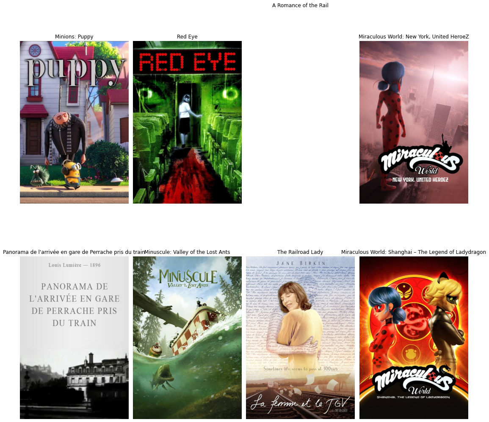

T<h1> Movie Recommendation Model </h1>

This was one of my first projects that I designed while undertaking data science. 

<h2>Table of Contents</h2>
<li><ah ref = "Introduction"> Intrduction </ah></li>
<li><ah ref = "Working"> Working</ah></li>
<li><ah ref = "Results"> Results</ah></li>
<li><ah ref = "Example"> Example</ah></li>

<h2 id = "Introduction">Introduction</h2>
The main idea of this model is to provide movie recommendations based on distributing information received from tags of a movie. We've all indugled in such instances where we watch a certain movie and are totally in awe with the storyline, their sequence of actions and acting. Our brain, being a dopaminergic thrill seeker, tends to want more relevant movies, or with similar genres. This movie model tends to focus on tags of the movies to determine relevant titles that would have the similar storyline or similar genre and suggests it to the user. This makes use of natural language toolkit to allow the computer to understand the requirements and give out results.

<h2 id = "Working">Working</h2>
The first and most important part was data cleaning. The dataset that was available had a lot of null values which were to be dealt with. Then, it was important to deal with the duplicate values. Since many movies are released with the same title (like Toy Story, Toy Story 2) yet they still share the same genre (or tags in this case). Thus, it was important to remove the duplicated values. Since the dataset had many values (movies) we would consider the movies with more than 20 votes. Finally, all the columns with null and duplicate values would be removed. 
The tags were then converted into vector values using SnowballStemmer library. Then, a model was created that would learn from the tags, and suggest movies based upon similar tags. The tags consist of different data columns included which would allow the model to learn sufficiently to suggest movies based on similar tags, similar keywords, similar genre and similar credits. 

<h2 id = "Ëxample"> Example </h2>

